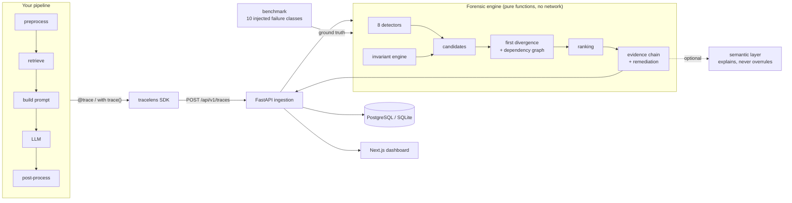

# TraceLens

**Find the stage where an AI pipeline first went wrong — and the evidence that clears the ones after it.**


> The CI badge is intentionally absent: this repository has no remote yet, and a
> badge pointing at a workflow that has never run would be decoration, not
> evidence. Add it once `.github/workflows/ci.yml` has executed.

---

## The problem

A RAG pipeline returns a wrong answer. Nothing crashed. Every span reports `ok`,
latency is normal, the error rate is zero, and your observability stack shows a
green dashboard.

The retriever returned a policy document that was superseded last year. The
prompt builder faithfully carried it. The model faithfully answered from it.
Every stage did exactly its job, and the user got the wrong answer anyway.

Existing tracing tools show you *that* eleven stages ran. They do not tell you
*which one* is worth fixing — and with a wrong-but-not-failing run, they do not
tell you anything went wrong at all.

## The solution

TraceLens records a pipeline run as a trace, then answers one question:

> Where did this pipeline first deviate from the expected or internally
> consistent state, what evidence supports that, and what followed from it?

It separates three populations that a flat list of anomalies conflates:

| | |
|---|---|
| **Root-cause candidate** | the earliest stage whose problem is its own |
| **Downstream consequence** | a stage whose problem is explained by an upstream one |
| **Unrelated anomaly** | a real problem on a stage that fed nothing |

Then it argues its case. Saying "the retriever is at fault" invites "how do you
know it wasn't the model?", so the report answers that too:

```text
WHY DID THIS PIPELINE FAIL?

  Likely root cause       retriever (retrieval)
  Diagnostic confidence   80%          (a diagnostic score, not a probability)
  First divergence        retriever
  Analysis time           0.7 ms

  Evidence
    1. [cause ] retriever returned stale document(s): refund-2019
                (superseded by refund-2026)
    2. [clears] prompt-builder carried the retrieved content into the prompt
                unchanged, so the prompt reflects what retrieval returned
    3. [clears] llm produced an answer consistent with the prompt it was given,
                so the model followed its evidence
    4. [clears] validator raised no validation failure

  Recommended remediation
    - Review the retriever: check index freshness, the filter that should
      exclude superseded documents, and whether the query reaches the index.
```

That output is real — it is what `python examples/rag_pipeline/main.py` prints.

## Architecture



The engine is deliberately the boring part: detection, invariants, divergence,
and ranking are pure functions over the trace with no network access and no
model call. That is what makes a benchmark number reproducible by anyone who
clones the repository.

## How the diagnosis works

Three ideas do most of the work.

**Evidence provenance sets confidence.** A detector's confidence is anchored to
*how* it knows, not how sure it feels: `1.0` only for a directly observed fact
(a span carries an exception), `0.5–0.9` for a deterministic rule violation,
below `0.5` for a heuristic with no baseline. Latency with no history reports
`0.35` and says "no baseline to compare against" in its own summary.

**Dependency, not just order.** The earliest anomaly in a trace may sit in a
branch that never fed the failure. The engine builds a dependency graph —
nesting, then recorded data flow, then sequence as a fallback — so a parallel
blip is reported as unrelated rather than blamed.

**Some categories cannot originate a failure.** A slow stage or a malformed
trace is worth reporting and worth corroborating with, but naming latency as
the root cause of a wrong answer is a bad diagnosis, and the engine will not do
it.

Full walkthrough: [docs/forensic-methodology.md](docs/forensic-methodology.md).

## Features

- **Instrumentation SDK** — one entry point (`trace`) that works as a context
  manager and a decorator, sync and async, with `contextvars` propagation so
  concurrent retrieval and tool calls attach to the right parent
- **8 detectors** — execution failure, schema violation, missing information,
  latency anomaly, semantic inconsistency, retrieval failure, unsupported
  claims, structural anomaly
- **Invariant engine** — declare rules your pipeline must hold (`user_id`
  stable, context relevant, tool results not contradicted) and get an
  explanation when one breaks
- **First-divergence engine** — the core; separates cause from consequence
- **Root-cause ranking** — auditable score, every factor recorded
- **Evidence chains** — including exculpatory evidence that clears the stages
  downstream of the cause
- **Optional semantic layer** — a model explains the evidence; when it
  disagrees the report records the disagreement rather than deferring to it
- **Replay and run comparison** — diff two runs stage by stage, reporting the
  first behavioural difference
- **Reproducible benchmark** — 10 injected failure classes plus 3 harder
  compound scenarios, with ground truth
- **Dashboard** — trace tree, forensic report, overview, failures, benchmarks
- **Privacy controls** — full / redacted / metadata-only payload capture

## Tech stack

| Layer | Choice |
|---|---|
| SDK & backend | Python 3.12+, Pydantic 2, FastAPI, SQLAlchemy 2, Alembic |
| Storage | SQLite by default, PostgreSQL 16 in the container stack |
| Frontend | Next.js 15 (App Router), React 19, TypeScript, no UI framework |
| Quality | ruff, mypy, pytest — 448 tests |
| Infra | Docker Compose, GitHub Actions |

Architecture decisions, including what was deliberately *not* built and why,
are in [DECISIONS.md](DECISIONS.md).

## Installation

```bash
git clone <your-remote>/tracelens.git
cd tracelens
python -m venv .venv && source .venv/bin/activate   # Windows: .venv\Scripts\activate
pip install -e ".[backend,dev]"
```

No `.env` is required. Every setting has a working default; copy
`.env.example` to `.env` only when you want to change one.

### See it work in 30 seconds

```bash
python examples/rag_pipeline/main.py
```

### Run the whole stack

```bash
python -m benchmark.seed_demo --reset --questions 3   # 42 synthetic traces
uvicorn app.main:app --reload                         # API on :8000
npm --prefix frontend install && npm --prefix frontend run dev   # UI on :3000
```

Or with containers:

```bash
docker compose up --build     # db + api + web
docker compose down           # stop, keep the database
docker compose down -v        # stop and delete the volume
```

| Service | Port | Health |
|---|---|---|
| `web` | 3000 | — |
| `api` | 8000 | `GET /api/v1/health` (does a real database round trip) |
| `db` | 5432 | `pg_isready` |

## SDK usage

```python
from tracelens import configure, trace, HttpExporter, Stage

configure(project="support", exporter=HttpExporter("http://localhost:8000"))

with trace("customer-support"):
    with trace("retriever", stage=Stage.RETRIEVAL) as span:
        span.inputs = {"query": question}
        span.outputs = {"documents": retrieve(question)}
```

The same name works as a decorator, and opens a trace or a child span depending
on what is already running:

```python
@trace("retriever", stage=Stage.RETRIEVAL)
def retrieve(query: str, top_k: int = 3) -> list[dict]: ...
```

Arguments are captured by parameter name, which is what later lets the
invariant engine follow a value across a stage boundary. Full reference,
including the payload conventions that unlock stronger detection:
[docs/sdk.md](docs/sdk.md).

## Benchmark results

Measured, not asserted. Reproduce with `python -m benchmark.run --all`; the run
is deterministic.

**112 cases — 96 injected failures, 16 healthy controls**

| Metric | Result |
|---|---|
| Root-cause accuracy | **100.0%** (96/96) |
| Detection precision | 100.0% |
| Detection recall | 100.0% |
| F1 | 1.000 |
| False-positive rate | **0.0%** (0/16 healthy controls flagged) |
| Mean analysis latency | 4.70 ms |
| Median / p95 | 4.28 ms / 6.86 ms |

Per class, all 14 scenarios scored 100% detection and 100% localisation:
wrong document, outdated document, missing context, context corruption, prompt
corruption, schema violation, tool timeout, wrong tool response, unsupported
claim, post-processing corruption, plus three harder ones — a stale retrieval
beside a slow model, two faults in one run, and a slow-but-correct run.

### Read that number honestly

**A perfect score on a benchmark says as much about the benchmark as about the
engine.** The benchmark, the injections, and the engine share an author; the
corpus is eight documents; and each injection breaks a stage in a way some
detector was built to see. Treat this as a **regression suite** that proves the
engine still separates the cases it was designed to separate — not as evidence
about production pipelines, paraphrased failures, or faults nobody anticipated.

The harder tier exists because the first ten scenarios each break exactly one
stage, which tests the detectors but barely tests the discrimination logic that
is the point of the project. Those three add a competing signal, and the
earliest cause still has to win.

Methodology, ground truth, and how to add a scenario:
[docs/benchmark.md](docs/benchmark.md).

## Development

```bash
pytest -q                    # 448 tests
ruff check . && ruff format --check .
mypy
alembic upgrade head         # migrations (SQLite and PostgreSQL)
python -m benchmark.run --all
```

CI runs lint, types, tests, migrations against both SQLite and a real
PostgreSQL service, an API health check, the benchmark, and the frontend build.
The benchmark job is a gate, not a report: it exits non-zero if any healthy
control is flagged, so a regression that makes the engine noisier fails the
build. No API key appears anywhere in CI.

## Limitations

Stated plainly, because a forensics tool that oversells itself is the wrong
kind of tool.

- **Not production-ready.** Single-node, no authentication, no multi-tenancy,
  no retention policy. It has never run against production traffic.
- **The benchmark is synthetic**, and self-authored. See above.
- **Semantic checks are lexical, not embedding-based** (D-002). A paraphrase
  sharing no content words with its source reads as ungrounded. This is a
  deliberate trade for reproducibility and auditability; revisit it if
  grounding recall proves inadequate against ground truth.
- **The diagnostic score is not calibrated.** It ranks candidates within one
  trace. It is not a probability and is not comparable across traces.
- **Latency detection has no historical baseline** unless you supply one, so
  it reports low confidence and says so.
- **Dependency inference falls back to sequential order** when a pipeline
  records no payloads, so a genuinely parallel uninstrumented pipeline is
  inferred as linear.
- **The Anthropic provider is written against the SDK but has not been run**
  against the live API in this environment; the mock provider is the tested,
  default path.
- **Container images have not been built.** The Docker daemon would not start
  here, so `docker compose config` validates but the images are unverified.

## Future work

- Calibrate the diagnostic score against labelled real incidents, so the
  number can honestly be called a probability
- Per-stage latency baselines learned from history, promoting latency from a
  0.35-confidence heuristic to a real comparison
- Embedding-backed grounding as an optional detector alongside the lexical one
- A trace-diff view in the dashboard on top of the existing replay engine
- OpenTelemetry exporter — the data model is already OTel-shaped (D-005)

## License

MIT. See [LICENSE](LICENSE).
